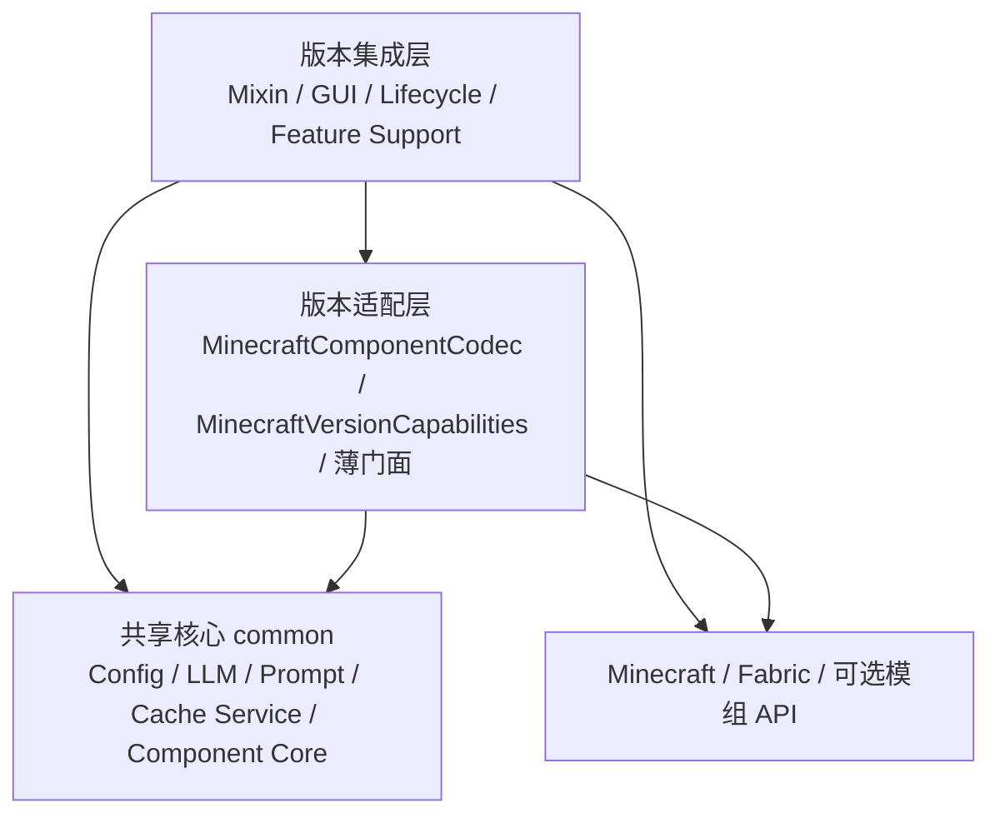

# Translate All in One 跨分支源码定位图

本文用于在不同 Minecraft/Fabric 分支中定位代码，并说明当前“共享核心 + 版本集成层”架构。所有路径均相对于仓库根目录。具体 Minecraft、mappings、Fabric、Java 和测试源集以当前分支的 [`gradle.properties`](../gradle.properties) 与 [`build.gradle`](../build.gradle) 为准。

## 先判断改动属于哪一层

| 改动类型 | 首先打开 | 应落位置 |
| --- | --- | --- |
| Prompt、Provider 路由、配置模型、LLM 协议 | [`common/`](../common)、[`PromptMessageBuilder.java`](../common/src/main/java/com/alexeys/translate_allinone/utils/translate/PromptMessageBuilder.java) | `common/src/main/java` |
| 缓存状态、队列、持久化、Component JSON 校验 | [`utils/cache/`](../common/src/main/java/com/alexeys/translate_allinone/utils/cache)、[`utils/componentjson/`](../common/src/main/java/com/alexeys/translate_allinone/utils/componentjson) | `common/src/main/java` |
| Minecraft Component 编解码 | [`ComponentCodec.java`](../common/src/main/java/com/alexeys/translate_allinone/versionapi/ComponentCodec.java) | common 放契约；[`MinecraftComponentCodec.java`](../src/main/java/com/alexeys/translate_allinone/versionapi/MinecraftComponentCodec.java) 放当前版本实现 |
| 某版本是否支持一项集成 | [`VersionCapabilities.java`](../common/src/main/java/com/alexeys/translate_allinone/versionapi/VersionCapabilities.java) | common 放能力结构；[`MinecraftVersionCapabilities.java`](../src/main/java/com/alexeys/translate_allinone/versionapi/MinecraftVersionCapabilities.java) 放当前分支能力值 |
| Mixin、Screen、渲染、命令、Fabric 生命周期 | [`src/main/java/`](../src/main/java) | 当前版本的 `src/main` |
| 配置目录、缓存路径、Minecraft 类型桥接 | 当前版本的 Runtime/Cache 门面 | `src/main` 薄门面，业务实现委托给 common Service/Core |

不要把“版本 API 层”理解成只有 `versionapi/` 目录。凡是直接依赖 Minecraft、Fabric、Mixin 或当前 mappings 的代码都属于版本集成层，包括 Mixin、GUI、注册、渲染 Support 和薄门面。

## 三层依赖关系



依赖方向只能从版本层指向 common。`common` 使用 Java 标准库、Gson 和 SLF4J，不得导入 `net.minecraft` 或 `net.fabricmc`。根项目通过 [`settings.gradle`](../settings.gradle) 引入 `common`，通过 [`build.gradle`](../build.gradle) 编译依赖并把 common 输出打入最终 jar。

## 共享核心定位

### 配置、Provider 与 Prompt

| 目标 | 共享入口 | 版本侧入口 |
| --- | --- | --- |
| 根配置和功能配置 | [`ModConfig.java`](../common/src/main/java/com/alexeys/translate_allinone/utils/config/ModConfig.java)、[`utils/config/pojos/`](../common/src/main/java/com/alexeys/translate_allinone/utils/config/pojos) | [`ConfigManager.java`](../src/main/java/com/alexeys/translate_allinone/registration/ConfigManager.java)、配置 UI |
| 功能到 Provider/模型路由 | [`ProviderRouteResolver.java`](../common/src/main/java/com/alexeys/translate_allinone/utils/config/ProviderRouteResolver.java)、[`ProviderManagerConfig.java`](../common/src/main/java/com/alexeys/translate_allinone/utils/config/pojos/ProviderManagerConfig.java) | `gui/configui/sections/` 的路由选择器 |
| 默认 Prompt 与覆盖 | [`PromptMessageBuilder.java`](../common/src/main/java/com/alexeys/translate_allinone/utils/translate/PromptMessageBuilder.java)、[`ItemTranslationPromptSupport.java`](../common/src/main/java/com/alexeys/translate_allinone/utils/translate/ItemTranslationPromptSupport.java) | 各 Manager/Support 只选择 route key 和 suffix |
| 远端协议 | [`LLM.java`](../common/src/main/java/com/alexeys/translate_allinone/utils/llmapi/LLM.java)、[`openai/`](../common/src/main/java/com/alexeys/translate_allinone/utils/llmapi/openai)、[`ollama/`](../common/src/main/java/com/alexeys/translate_allinone/utils/llmapi/ollama) | 版本层提供配置、日志和调用时机 |

新增 Prompt 时先在 `PromptMessageBuilder` 增加 route key，再更新 Provider 覆盖编辑 UI 和调用方。不要在各版本 Manager 中重新放置长提示词。

`LLM`、Component 响应客户端和版本 Manager 都不得对可能已计费的请求自动重发。只有明确的非成功 HTTP“结构化格式不支持”响应允许切换输出格式；成功 HTTP 的空内容、截断、解析或校验失败直接进入粘性错误状态。

### Component 结构化翻译

| 阶段 | 共享实现 | 版本门面或适配 |
| --- | --- | --- |
| Minecraft Component 转 JSON | [`ComponentCodec.java`](../common/src/main/java/com/alexeys/translate_allinone/versionapi/ComponentCodec.java) | [`MinecraftComponentCodec.java`](../src/main/java/com/alexeys/translate_allinone/versionapi/MinecraftComponentCodec.java)、[`ComponentJsonCodec.java`](../src/main/java/com/alexeys/translate_allinone/utils/componentjson/ComponentJsonCodec.java) |
| JSON 文档构造 | [`ComponentJsonDocumentBuilder.java`](../common/src/main/java/com/alexeys/translate_allinone/utils/componentjson/ComponentJsonDocumentBuilder.java) | [`ComponentDocumentBuilder.java`](../src/main/java/com/alexeys/translate_allinone/utils/componentjson/ComponentDocumentBuilder.java) 编码 Minecraft 类型后委托 |
| 请求、批处理和响应 | [`ComponentTranslationRequest.java`](../common/src/main/java/com/alexeys/translate_allinone/utils/componentjson/ComponentTranslationRequest.java)、[`ComponentTranslationBatch.java`](../common/src/main/java/com/alexeys/translate_allinone/utils/componentjson/ComponentTranslationBatch.java)、[`ComponentTranslationResponseClient.java`](../common/src/main/java/com/alexeys/translate_allinone/utils/componentjson/ComponentTranslationResponseClient.java) | [`ComponentTranslationClient.java`](../src/main/java/com/alexeys/translate_allinone/utils/componentjson/ComponentTranslationClient.java) 注入当前配置和诊断 |
| 状态机、队列和会话 | [`ComponentTranslationRuntimeCore.java`](../common/src/main/java/com/alexeys/translate_allinone/utils/componentjson/ComponentTranslationRuntimeCore.java)、[`ComponentTranslationRuntimeState.java`](../common/src/main/java/com/alexeys/translate_allinone/utils/componentjson/ComponentTranslationRuntimeState.java) | [`ComponentTranslationRuntime.java`](../src/main/java/com/alexeys/translate_allinone/utils/componentjson/ComponentTranslationRuntime.java) 注入 readiness、Store 和客户端 |
| 校验与回写 | [`ComponentTranslationValidator.java`](../common/src/main/java/com/alexeys/translate_allinone/utils/componentjson/ComponentTranslationValidator.java)、[`ComponentTranslationJsonApplier.java`](../common/src/main/java/com/alexeys/translate_allinone/utils/componentjson/ComponentTranslationJsonApplier.java)、[`ComponentTranslationAdapter.java`](../common/src/main/java/com/alexeys/translate_allinone/utils/componentjson/ComponentTranslationAdapter.java) | [`ComponentTranslationApplier.java`](../src/main/java/com/alexeys/translate_allinone/utils/componentjson/ComponentTranslationApplier.java) 返回当前版本 Component |

告示牌、实体、书本、成就、计分板、屏幕 UI 和大部分 Tooltip 最终都接入这套结构化翻译基础设施。具体捕获仍留在版本层，因为 Minecraft Component、渲染上下文和 Mixin 目标会跨版本变化。

### 缓存、队列与备份

| 共享 Service/Core | 当前版本薄门面 | 责任边界 |
| --- | --- | --- |
| [`ItemTemplateCacheService.java`](../common/src/main/java/com/alexeys/translate_allinone/utils/cache/ItemTemplateCacheService.java) | [`ItemTemplateCache.java`](../src/main/java/com/alexeys/translate_allinone/utils/cache/ItemTemplateCache.java) | common 处理队列、缓存和保存；门面解析 Fabric 配置路径并连接备份/诊断 |
| [`TextTranslationCacheService.java`](../common/src/main/java/com/alexeys/translate_allinone/utils/cache/TextTranslationCacheService.java) | [`WynnDialogueTextCache.java`](../src/main/java/com/alexeys/translate_allinone/utils/cache/WynnDialogueTextCache.java)、[`WynntilsTaskTrackerTextCache.java`](../src/main/java/com/alexeys/translate_allinone/utils/cache/WynntilsTaskTrackerTextCache.java) | common 复用文本缓存生命周期；门面只给出文件名和路径 |
| [`JsonStringTranslationCacheService.java`](../common/src/main/java/com/alexeys/translate_allinone/utils/cache/JsonStringTranslationCacheService.java) | [`SkyblockNpcTranslationCache.java`](../src/main/java/com/alexeys/translate_allinone/utils/cache/SkyblockNpcTranslationCache.java) | common 负责 JSON 字符串缓存；门面连接版本环境 |
| [`ComponentTranslationStore.java`](../common/src/main/java/com/alexeys/translate_allinone/utils/cache/component/ComponentTranslationStore.java) | [`ComponentTranslationStoreRegistry.java`](../src/main/java/com/alexeys/translate_allinone/utils/cache/component/ComponentTranslationStoreRegistry.java) | Store 是共享实现；Registry 注入目录、备份和日志 |
| [`CacheBackupService.java`](../common/src/main/java/com/alexeys/translate_allinone/utils/cache/CacheBackupService.java) | [`CacheBackupManager.java`](../src/main/java/com/alexeys/translate_allinone/utils/cache/CacheBackupManager.java) | Service 实现备份策略；Manager 提供 Fabric 路径和配置 |

通用状态对象在 [`TranslationStatus.java`](../common/src/main/java/com/alexeys/translate_allinone/utils/cache/TranslationStatus.java)、[`LookupResult.java`](../common/src/main/java/com/alexeys/translate_allinone/utils/cache/LookupResult.java) 和 [`CacheStats.java`](../common/src/main/java/com/alexeys/translate_allinone/utils/cache/CacheStats.java)。队列或强制刷新问题先检查 [`CacheRuntimeStateSupport.java`](../common/src/main/java/com/alexeys/translate_allinone/utils/cache/CacheRuntimeStateSupport.java) 与 [`CacheKeyQueueSupport.java`](../common/src/main/java/com/alexeys/translate_allinone/utils/cache/CacheKeyQueueSupport.java)。

失败键停留在 `ERROR`，渲染或定时器不得把它自动送回 pending。显式强制刷新、Provider 配置变更、功能重启或新会话才允许清除错误并发起一次新请求。聊天输出的并发去重入口是 [`TranslationRequestSingleFlight.java`](../common/src/main/java/com/alexeys/translate_allinone/utils/translate/TranslationRequestSingleFlight.java)，版本侧 [`ChatOutputTranslateManager.java`](../src/main/java/com/alexeys/translate_allinone/utils/translate/ChatOutputTranslateManager.java) 以缓存键接入并把成功或失败分发给所有等待消息。

### 共享策略与状态

| 范围 | 文件 |
| --- | --- |
| 队列 Manager 生命周期 | [`AbstractTranslateManager.java`](../common/src/main/java/com/alexeys/translate_allinone/utils/translate/AbstractTranslateManager.java)、[`TranslationQueueWatchdog.java`](../common/src/main/java/com/alexeys/translate_allinone/utils/translate/TranslationQueueWatchdog.java) |
| 同缓存键进行中请求共享 | [`TranslationRequestSingleFlight.java`](../common/src/main/java/com/alexeys/translate_allinone/utils/translate/TranslationRequestSingleFlight.java) |
| 总开关与过期回调隔离 | [`TranslationFeatureGate.java`](../common/src/main/java/com/alexeys/translate_allinone/utils/translate/TranslationFeatureGate.java) |
| Wynn 对话显示和队列决策 | [`WynnDialogueDisplayModeSupport.java`](../common/src/main/java/com/alexeys/translate_allinone/utils/translate/WynnDialogueDisplayModeSupport.java)、[`WynnDialogueQueuePolicy.java`](../common/src/main/java/com/alexeys/translate_allinone/utils/translate/WynnDialogueQueuePolicy.java)、[`WynnDialoguePresentation.java`](../common/src/main/java/com/alexeys/translate_allinone/utils/translate/WynnDialoguePresentation.java) |
| UI 文本筛选与状态 | [`UiTextFilter.java`](../common/src/main/java/com/alexeys/translate_allinone/utils/translate/UiTextFilter.java)、[`UiScreenTextPolicy.java`](../common/src/main/java/com/alexeys/translate_allinone/utils/translate/UiScreenTextPolicy.java)、[`UiTranslationDiagnosticsCore.java`](../common/src/main/java/com/alexeys/translate_allinone/utils/translate/UiTranslationDiagnosticsCore.java)、[`UiTextRole.java`](../common/src/main/java/com/alexeys/translate_allinone/utils/translate/UiTextRole.java)、[`UiTranslationStatus.java`](../common/src/main/java/com/alexeys/translate_allinone/utils/translate/UiTranslationStatus.java) |
| 模板处理 | [`TemplateProcessor.java`](../common/src/main/java/com/alexeys/translate_allinone/utils/text/TemplateProcessor.java) |

## 版本集成层定位

### 启动、生命周期和配置

| 目标 | 文件 |
| --- | --- |
| Fabric 入口 | [`Translate_AllinOne.java`](../src/main/java/com/alexeys/translate_allinone/Translate_AllinOne.java) |
| 进入世界、ready、tick、断开和保存 | [`LifecycleEventManager.java`](../src/main/java/com/alexeys/translate_allinone/registration/LifecycleEventManager.java) |
| 配置加载、规范化和旧字段迁移 | [`ConfigManager.java`](../src/main/java/com/alexeys/translate_allinone/registration/ConfigManager.java)、[`ConfigMigrationSupport.java`](../src/main/java/com/alexeys/translate_allinone/registration/ConfigMigrationSupport.java) |
| 命令注册 | [`CommandManager.java`](../src/main/java/com/alexeys/translate_allinone/registration/CommandManager.java)、[`command/`](../src/main/java/com/alexeys/translate_allinone/command) |
| Mixin 清单 | [`translate_allinone.mixins.json`](../src/main/resources/translate_allinone.mixins.json) |

异步路径必须与 `ComponentTranslationRuntime.beginSession/endSession`、`TranslationFeatureGate` generation、各 Support 的 `resetSession` 及 Manager 的 stop/cancel 保持一致。旧世界的回调不得写回新会话。

### 功能入口

| 功能 | 捕获位置 | 主要业务入口 |
| --- | --- | --- |
| 聊天输出 | [`mixinChatHud/`](../src/main/java/com/alexeys/translate_allinone/mixin/mixinChatHud) | [`ChatOutputTranslateManager.java`](../src/main/java/com/alexeys/translate_allinone/utils/translate/ChatOutputTranslateManager.java) |
| 聊天输入与改写 | [`mixinChatScreen/`](../src/main/java/com/alexeys/translate_allinone/mixin/mixinChatScreen) | [`ChatInputTranslateManager.java`](../src/main/java/com/alexeys/translate_allinone/utils/translate/ChatInputTranslateManager.java)、[`gui/chatinput/`](../src/main/java/com/alexeys/translate_allinone/gui/chatinput) |
| Tooltip | [`mixinItem/`](../src/main/java/com/alexeys/translate_allinone/mixin/mixinItem) | [`TooltipTranslationSupport.java`](../src/main/java/com/alexeys/translate_allinone/utils/translate/TooltipTranslationSupport.java)、[`TooltipRoutePlanner.java`](../src/main/java/com/alexeys/translate_allinone/utils/translate/TooltipRoutePlanner.java)、[`TooltipTemplateRuntime.java`](../src/main/java/com/alexeys/translate_allinone/utils/translate/TooltipTemplateRuntime.java) |
| 原版计分板 | [`mixinInGameGui/`](../src/main/java/com/alexeys/translate_allinone/mixin/mixinInGameGui) | [`ScoreboardComponentTranslationSupport.java`](../src/main/java/com/alexeys/translate_allinone/utils/translate/ScoreboardComponentTranslationSupport.java)、[`ScoreboardTranslationInputSupport.java`](../src/main/java/com/alexeys/translate_allinone/utils/translate/ScoreboardTranslationInputSupport.java) |
| 告示牌 | [`mixinSign/`](../src/main/java/com/alexeys/translate_allinone/mixin/mixinSign) | [`SignTranslationSupport.java`](../src/main/java/com/alexeys/translate_allinone/utils/translate/SignTranslationSupport.java)、[`ContinuousSignTranslationCoordinator.java`](../src/main/java/com/alexeys/translate_allinone/utils/translate/ContinuousSignTranslationCoordinator.java) |
| 实体与文本展示 | [`mixinEntity/`](../src/main/java/com/alexeys/translate_allinone/mixin/mixinEntity) | [`EntityTextTranslationSupport.java`](../src/main/java/com/alexeys/translate_allinone/utils/translate/EntityTextTranslationSupport.java)、[`TextDisplayTranslationSupport.java`](../src/main/java/com/alexeys/translate_allinone/utils/translate/TextDisplayTranslationSupport.java) |
| 成书 | [`mixinBook/`](../src/main/java/com/alexeys/translate_allinone/mixin/mixinBook) | [`BookTranslationSupport.java`](../src/main/java/com/alexeys/translate_allinone/utils/translate/BookTranslationSupport.java) |
| 原版成就 | [`mixinAdvancement/`](../src/main/java/com/alexeys/translate_allinone/mixin/mixinAdvancement) | [`VanillaAdvancementTranslationSupport.java`](../src/main/java/com/alexeys/translate_allinone/utils/translate/VanillaAdvancementTranslationSupport.java) |
| 屏幕 UI | [`mixinScreenTranslate/`](../src/main/java/com/alexeys/translate_allinone/mixin/mixinScreenTranslate) | [`UiTranslationRuntime.java`](../src/main/java/com/alexeys/translate_allinone/utils/translate/UiTranslationRuntime.java)、[`UiScreenAdapterRegistry.java`](../src/main/java/com/alexeys/translate_allinone/utils/translate/UiScreenAdapterRegistry.java)、[`UiTranslationDiagnostics.java`](../src/main/java/com/alexeys/translate_allinone/utils/translate/UiTranslationDiagnostics.java) |
| Wynn NPC 对话 | [`mixinWynnDialogue/`](../src/main/java/com/alexeys/translate_allinone/mixin/mixinWynnDialogue) | [`WynnDialogueTranslationSupport.java`](../src/main/java/com/alexeys/translate_allinone/utils/translate/WynnDialogueTranslationSupport.java)、[`WynnDialogueTranslateManager.java`](../src/main/java/com/alexeys/translate_allinone/utils/translate/WynnDialogueTranslateManager.java)、[`WynnDialogueOverlayController.java`](../src/main/java/com/alexeys/translate_allinone/utils/translate/WynnDialogueOverlayController.java) |
| Wynntils 任务追踪 | [`mixinWynntils/`](../src/main/java/com/alexeys/translate_allinone/mixin/mixinWynntils) | [`WynntilsTaskTrackerTranslationSupport.java`](../src/main/java/com/alexeys/translate_allinone/utils/translate/WynntilsTaskTrackerTranslationSupport.java)、[`WynntilsTaskTrackerTranslateManager.java`](../src/main/java/com/alexeys/translate_allinone/utils/translate/WynntilsTaskTrackerTranslateManager.java) |

Mixin 类名可能因 mappings 或渲染 API 改名，因此跨分支文档只把目录作为稳定入口。编辑具体 Mixin 前必须读取当前分支的类、描述符和 mixin JSON。

### 本地词典

| 目标 | 文件 |
| --- | --- |
| 安装内置词典 | [`WynncraftDictionaryInstaller.java`](../src/main/java/com/alexeys/translate_allinone/utils/translate/WynncraftDictionaryInstaller.java) |
| 文件选择和槽位规则 | [`DictionaryFileSelectionSupport.java`](../src/main/java/com/alexeys/translate_allinone/utils/translate/DictionaryFileSelectionSupport.java) |
| 热重载 | [`DictionaryHotReloadManager.java`](../src/main/java/com/alexeys/translate_allinone/utils/translate/DictionaryHotReloadManager.java) |
| 统一查询门面 | [`WynnSharedDictionaryService.java`](../src/main/java/com/alexeys/translate_allinone/utils/translate/WynnSharedDictionaryService.java) |

## 能力开关与版本特有功能

共享配置不能因为某个版本缺少实现而被删除。以外部记分板为例：

1. [`ScoreboardConfig.java`](../common/src/main/java/com/alexeys/translate_allinone/utils/config/pojos/ScoreboardConfig.java) 在所有分支保留 `external_custom_scoreboard_mode`。
2. [`VersionCapabilities.java`](../common/src/main/java/com/alexeys/translate_allinone/versionapi/VersionCapabilities.java) 定义 `externalScoreboardTranslation`。
3. 各分支的 [`MinecraftVersionCapabilities.java`](../src/main/java/com/alexeys/translate_allinone/versionapi/MinecraftVersionCapabilities.java) 声明支持状态。
4. 支持的分支才包含外部记分板 Mixin、反射适配和运行时实现；不支持的分支仍能读取并写回配置，但隐藏 UI、禁用运行入口。

当前维护分支的能力值以各自源码为准：`26.1` 开启外部记分板翻译，`1.21.11` 关闭。新增能力时沿用同一结构，并为每个版本增加能力值测试。

## 配置 UI

配置数据位于 common，Minecraft Screen 实现位于版本层：

- 主屏：[`ModConfigScreen.java`](../src/main/java/com/alexeys/translate_allinone/gui/ModConfigScreen.java)
- 区段和路由：[`gui/configui/sections/`](../src/main/java/com/alexeys/translate_allinone/gui/configui/sections)
- 控件：[`gui/configui/controls/`](../src/main/java/com/alexeys/translate_allinone/gui/configui/controls)
- 交互：[`gui/configui/interaction/`](../src/main/java/com/alexeys/translate_allinone/gui/configui/interaction)
- Modal：[`gui/configui/modals/`](../src/main/java/com/alexeys/translate_allinone/gui/configui/modals)
- Provider 编辑逻辑：[`gui/configui/support/`](../src/main/java/com/alexeys/translate_allinone/gui/configui/support)

新增配置项时依次检查 common POJO、`ConfigManager` 规范化/迁移、版本能力、UI、运行时读取和配置往返测试。

## 测试放置

| 测试类型 | 位置 |
| --- | --- |
| 不依赖 Minecraft/Fabric 的共享测试 | [`common/src/test/java/`](../common/src/test/java) |
| 当前版本根源码测试 | [`src/test/java/`](../src/test/java) |
| 只对某个 API 家族编译的测试 | `src/test/<test_api_family>/java`，实际 family 由当前分支 [`build.gradle`](../build.gradle) 声明 |

`MinecraftComponentCodec`、Mixin 目标或版本能力的测试应留在版本测试源集；Prompt、缓存 Service/Core、配置数据语义和纯状态机测试应放 common。

## 跨分支维护检查

共享行为修改完成后，在每个维护分支执行：

```powershell
.\gradlew.bat :common:test
.\gradlew.bat test
.\gradlew.bat build
rg -n "^import (net\.minecraft|net\.fabricmc)" common/src/main/java
git diff --check
```

第一条 `rg` 应无结果。再比较两个工作树：

```powershell
git diff --no-index --name-status -- <分支A工作树>/common/src/main/java <分支B工作树>/common/src/main/java
```

预期共享一致时应无差异。涉及 Mixin、GUI 或渲染时，还要在每个受影响版本运行 `runClient` 冒烟。版本特有差异应集中在 `src/main`、能力值和资源清单，不应反向污染 common。

## 相关文档

- [`PROJECT_SUMMARY.md`](PROJECT_SUMMARY.md)：跨分支架构概览和日常维护规则。
- 仓库根目录的 `AGENTS.md`（若当前工作树提供）：仓库操作、版本敏感 API、测试和修改约束。
- `md/Archive/`（若当前分支提供）：历史方案，只用于追溯，不替代当前源码和本文。
