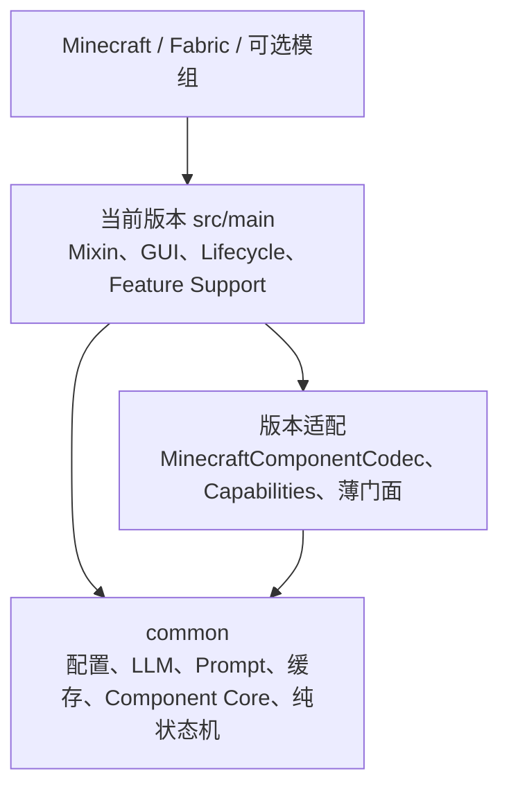

# Translate All in One 跨分支项目概要

本文描述多版本分支共同遵守的项目架构，不绑定某个 Minecraft、Fabric、mappings 或 Java 版本。当前分支的实际版本、依赖和测试 API family 必须从 [`gradle.properties`](../gradle.properties)、[`build.gradle`](../build.gradle) 和 [`fabric.mod.json`](../src/main/resources/fabric.mod.json) 读取。按功能定位具体源码时参阅 [`DEVELOPER_CODE_MAP.md`](DEVELOPER_CODE_MAP.md)。

## 1. 项目定位

`Translate All in One` 是仅客户端运行的 Fabric AI 翻译模组。它从 Minecraft 和可选客户端模组的文本渲染路径捕获内容，通过本地词典、持久缓存和异步 LLM 获得译文，并在保留样式、占位符和交互数据的前提下更新客户端显示。

主要功能包括：

- 聊天输出翻译，以及聊天输入翻译和 AI 改写。
- Tooltip、计分板、告示牌、实体、文本展示、成书、原版成就和配置屏幕翻译。
- WynnCraft 物品/技能、NPC 对话 HUD 和 Wynntils 任务追踪翻译。
- 多 Provider、多模型、按功能路由的请求；本地词典、持久缓存、自动备份和热加载。

共同处理链路是：`版本侧捕获 → 共享规则/路由 → 字典或缓存 → 异步翻译 → 结构校验 → 版本侧渲染`。

## 2. 多版本维护模型

每个 Minecraft 版本由独立 Git 分支维护。分支各自包含完整的根项目和 `common` 子项目，因此 common 在文件系统上仍会出现在每个分支中；架构目标是让所有受支持分支的 `common/src/main/java` 保持一致，只在版本集成层维护 API 差异。

这不等于所有版本差异都只能放进 `versionapi/` 目录。以下代码都属于版本集成层：

- `src/main/.../versionapi` 的 Minecraft 类型适配与能力值。
- Mixin、Fabric 注册、生命周期、Screen、GUI 和渲染代码。
- 需要 Minecraft Component、客户端对象或 FabricLoader 路径的 Support/Manager。
- 为 common Core/Service 提供路径、日志、readiness、Store 或回调的薄门面。

跨版本修改先判断是共享行为、版本 API 适配还是能力差异。共享行为在 common 实现并同步到所有维护分支；Minecraft/Fabric API 差异只在对应分支版本层适配；功能可用性差异使用能力开关。

## 3. 构建模块与依赖方向

[`settings.gradle`](../settings.gradle) 引入 `common` 子项目。根项目依赖 common，并在最终 jar 和 sources jar 中包含 common 输出。



[`common/build.gradle`](../common/build.gradle) 只使用 Java 标准库、Gson、SLF4J 和 JUnit。common 必须保持 Minecraft/Fabric 无关，不能导入 `net.minecraft` 或 `net.fabricmc`，也不能用版本字符串分支行为。

## 4. common 共享核心

### 4.1 配置、Provider 和 LLM

根配置 [`ModConfig.java`](../common/src/main/java/com/alexeys/translate_allinone/utils/config/ModConfig.java) 和各功能 POJO 位于 common。版本侧 [`ConfigManager.java`](../src/main/java/com/alexeys/translate_allinone/registration/ConfigManager.java) 负责确定配置路径、加载、规范化、历史迁移和写回。

[`ProviderRouteResolver.java`](../common/src/main/java/com/alexeys/translate_allinone/utils/config/ProviderRouteResolver.java) 把功能路由解析为 Provider/模型快照。[`LLM.java`](../common/src/main/java/com/alexeys/translate_allinone/utils/llmapi/LLM.java) 统一适配 OpenAI Chat Completions、OpenAI Responses 和 Ollama，并处理流式/非流式请求、结构化输出能力和响应后处理。

默认 Prompt、语言占位符和 Provider 覆盖由 [`PromptMessageBuilder.java`](../common/src/main/java/com/alexeys/translate_allinone/utils/translate/PromptMessageBuilder.java) 统一维护。版本侧 Manager 只选择 route key、目标语言和 suffix，不应包含重复的长提示词。

远端调用遵守单次发送语义：同一业务 work 不因超时、连接失败、限流、服务端错误、响应截断、JSON/键/占位符校验失败或内部后处理失败而自动再次调用 Provider。结构化输出仅在 Provider 明确以非成功 HTTP 响应声明格式不受支持时降级；收到成功 HTTP 响应后即使内容无效也不再发送。失败保留为 `ERROR`，只有用户强制刷新、Provider 配置变更、功能重启或新会话会清除。

### 4.2 Component 结构化翻译

Minecraft Component 先由版本侧 [`MinecraftComponentCodec.java`](../src/main/java/com/alexeys/translate_allinone/versionapi/MinecraftComponentCodec.java) 实现 common 的 [`ComponentCodec.java`](../common/src/main/java/com/alexeys/translate_allinone/versionapi/ComponentCodec.java)，转换为 Gson JSON。之后由 common 完成：

1. [`ComponentJsonDocumentBuilder.java`](../common/src/main/java/com/alexeys/translate_allinone/utils/componentjson/ComponentJsonDocumentBuilder.java) 提取文本单元并生成稳定文档。
2. [`ComponentTranslationRuntimeCore.java`](../common/src/main/java/com/alexeys/translate_allinone/utils/componentjson/ComponentTranslationRuntimeCore.java) 协调缓存、排队、会话和粘性失败状态。
3. [`ComponentTranslationResponseClient.java`](../common/src/main/java/com/alexeys/translate_allinone/utils/componentjson/ComponentTranslationResponseClient.java) 发送并解析结构化请求。
4. [`ComponentTranslationValidator.java`](../common/src/main/java/com/alexeys/translate_allinone/utils/componentjson/ComponentTranslationValidator.java) 校验键、顺序、占位符和受保护 token。
5. [`ComponentTranslationAdapter.java`](../common/src/main/java/com/alexeys/translate_allinone/utils/componentjson/ComponentTranslationAdapter.java) 把合法译文应用到 JSON，再由版本 Codec 还原为当前 Minecraft Component。

版本侧 [`ComponentTranslationRuntime.java`](../src/main/java/com/alexeys/translate_allinone/utils/componentjson/ComponentTranslationRuntime.java) 和相关类是适配门面：它们提供客户端 readiness、当前配置、Store、诊断和 Minecraft 类型，不重复 common 状态机。

### 4.3 缓存与备份

缓存队列、并发状态、强制刷新、持久化和备份算法位于 common：

- [`CacheRuntimeStateSupport.java`](../common/src/main/java/com/alexeys/translate_allinone/utils/cache/CacheRuntimeStateSupport.java) 与 [`CacheKeyQueueSupport.java`](../common/src/main/java/com/alexeys/translate_allinone/utils/cache/CacheKeyQueueSupport.java) 管理 pending、in-progress、刷新和完成状态。
- [`TranslationRequestSingleFlight.java`](../common/src/main/java/com/alexeys/translate_allinone/utils/translate/TranslationRequestSingleFlight.java) 让版本侧按稳定缓存键共享同一个进行中请求；聊天输出用它保证相同模板并发只调用一次 Provider。
- [`ItemTemplateCacheService.java`](../common/src/main/java/com/alexeys/translate_allinone/utils/cache/ItemTemplateCacheService.java)、[`TextTranslationCacheService.java`](../common/src/main/java/com/alexeys/translate_allinone/utils/cache/TextTranslationCacheService.java) 和 [`JsonStringTranslationCacheService.java`](../common/src/main/java/com/alexeys/translate_allinone/utils/cache/JsonStringTranslationCacheService.java) 提供可复用缓存实现。
- [`ComponentTranslationStore.java`](../common/src/main/java/com/alexeys/translate_allinone/utils/cache/component/ComponentTranslationStore.java) 管理 Component 模块缓存。
- [`CacheBackupService.java`](../common/src/main/java/com/alexeys/translate_allinone/utils/cache/CacheBackupService.java) 实现备份、校验和保留策略。

版本侧 `ItemTemplateCache`、Wynn 缓存、Store Registry 和 `CacheBackupManager` 只解析 Fabric 配置目录并注入配置、日志或备份回调。缓存格式变化必须同时评估兼容迁移、版本升级备份和恢复测试。

### 4.4 纯策略与生命周期基类

[`AbstractTranslateManager.java`](../common/src/main/java/com/alexeys/translate_allinone/utils/translate/AbstractTranslateManager.java) 提供异步 Manager 基础生命周期，不负责自动重试。[`TranslationFeatureGate.java`](../common/src/main/java/com/alexeys/translate_allinone/utils/translate/TranslationFeatureGate.java) 和 session epoch 防止旧回调写入新世界。Wynn 展示/队列决策、UI 文本过滤和模板处理等不依赖 Minecraft 类型的逻辑也位于 common。

## 5. 版本契约与能力开关

[`common/.../versionapi`](../common/src/main/java/com/alexeys/translate_allinone/versionapi) 只放窄契约和能力数据；[`src/main/.../versionapi`](../src/main/java/com/alexeys/translate_allinone/versionapi) 放当前版本实现。

当前契约包括：

- `ComponentCodec<C>`：隔离不同 mappings 下的 Component 序列化 API。
- `VersionCapabilities`：声明共享功能是否在当前版本拥有可用集成。

能力差异遵循以下结构：

1. 配置字段和枚举继续放 common，并在所有分支保留序列化语义。
2. common 的 `VersionCapabilities` 增加能力字段。
3. 每个分支的 `MinecraftVersionCapabilities` 提供布尔值。
4. UI 和运行时检查能力；只有支持的分支包含对应 Mixin、反射适配或其他集成代码。
5. 各版本测试能力值，不支持版本测试配置仍可往返保存。

当前例子是外部记分板翻译：`26.1` 能力开启，`1.21.11` 能力关闭；两边共享同一个 `ScoreboardConfig`。这使用户在版本间切换时不会因低能力版本加载配置而丢失字段。

## 6. 版本集成层

Fabric 主入口是 [`Translate_AllinOne.java`](../src/main/java/com/alexeys/translate_allinone/Translate_AllinOne.java)。它按当前版本 API 完成版本升级备份、配置、Component 缓存、词典、更新检查、命令、生命周期和 Wynn 对话初始化。

[`LifecycleEventManager.java`](../src/main/java/com/alexeys/translate_allinone/registration/LifecycleEventManager.java) 协调世界会话：

- 进入世界时开始 Component session、重置显示状态、加载缓存并启动队列 Manager。
- 客户端满足当前版本的 readiness 条件后才允许持续翻译。
- tick 负责刷新按键、HUD/动画和需要持续协调的功能。
- 断开或关闭功能时取消任务、结束 session、停止 Manager 并保存缓存。

Mixin 位于 [`mixin/`](../src/main/java/com/alexeys/translate_allinone/mixin)，清单位于 [`translate_allinone.mixins.json`](../src/main/resources/translate_allinone.mixins.json)。Mixin 应只捕获、替换或桥接数据；翻译策略、缓存和错误处理放进现有 Support、Manager 或 common Core。

GUI、命令和具体 Feature Support 也位于版本层，因为它们直接依赖当前 Minecraft 类型。跨版本时允许这些文件使用不同类名和方法签名，但对 common 的调用语义应保持一致。

## 7. 主要功能边界

| 功能 | 版本捕获入口 | 主要协调入口 |
| --- | --- | --- |
| 聊天输出/输入 | `mixinChatHud/`、`mixinChatScreen/` | `ChatOutputTranslateManager`、`ChatInputTranslateManager` |
| Tooltip | `mixinItem/` | `TooltipTranslationSupport`、`TooltipRoutePlanner`、`TooltipTemplateRuntime` |
| 计分板 | `mixinInGameGui/` | `ScoreboardComponentTranslationSupport`、能力允许时的外部记分板适配 |
| 告示牌、实体、书本、成就 | 对应 `mixinSign/`、`mixinEntity/`、`mixinBook/`、`mixinAdvancement/` | 对应 Feature Support，最终接入 Component Core |
| 屏幕 UI | `mixinScreenTranslate/` | `UiTranslationRuntime` 与 Screen Adapter Registry |
| Wynn NPC 对话 | `mixinWynnDialogue/` | `WynnDialogueTranslationSupport`、`WynnDialogueTranslateManager`、Overlay/HUD Presenter |
| Wynntils 任务追踪 | `mixinWynntils/` | `WynntilsTaskTrackerTranslationSupport`、`WynntilsTaskTrackerTranslateManager` |

具体 Mixin 类名不是跨分支稳定接口。修改渲染或注入时应从当前分支 mixin JSON 和目录开始，核对目标类、描述符、局部变量、remap 与可选模组是否存在。

## 8. 日常维护规则

### 修改共享行为

1. 在 common 实现配置、Prompt、缓存、协议、校验或纯状态变化。
2. 在 `common/src/test/java` 添加不依赖 Minecraft 的测试。
3. 把相同 common diff 同步到所有维护分支。
4. 只在各分支版本层补足类型转换、路径、生命周期或 UI/Mixin 接线。
5. 比较各分支 `common/src/main/java`，预期无差异。

### 适配新的 Minecraft/Fabric API

先确认 common 契约是否足够。契约足够时只改当前分支 `src/main`；契约不足时先最小化扩展 common 接口，再为所有分支实现。不要把 Minecraft 类型暴露到 common，也不要在 common 中写版本号判断。

### 增加版本特有功能

共享配置和业务语义放 common；能力值放 `MinecraftVersionCapabilities`；Mixin、反射和渲染实现只放支持版本。不支持版本必须能安全加载、保留并保存配置。

### 修改持久化数据

配置或缓存结构变化必须考虑旧字段、坏文件恢复、备份、迁移和跨版本往返。删除字段前先判断它是否只是当前版本暂不支持；能力不足不是删除共享字段的理由。

## 9. 测试与提交门禁

测试分三层：

- `common/src/test/java`：共享核心和纯 Java 行为。
- `src/test/java`：当前版本根源码和配置集成。
- `src/test/<test_api_family>/java`：只对当前 Minecraft API family 编译的测试；family 名称从 `build.gradle` 读取。

共享行为或跨版本迁移至少在每个受影响分支执行：

```powershell
.\gradlew.bat :common:test
.\gradlew.bat test
.\gradlew.bat build
rg -n "^import (net\.minecraft|net\.fabricmc)" common/src/main/java
git diff --check
```

再比较分支间的 common 主源码。涉及 Mixin、Screen、渲染或生命周期时运行对应版本的 `runClient` 冒烟；涉及服务器路径时运行目标分支提供的服务端或集成任务。

只有测试、构建、运行冒烟和差异复核全部通过后才能创建提交。提交只包含本任务文件，遵守用户要求的仅标题风格；除非明确要求，不 push、不创建 PR、不改写历史。

## 10. 维护目标

后续维护应尽量形成以下稳定状态：

- common 的业务逻辑和测试跨分支一致。
- Minecraft/Fabric 变化集中在版本实现、Mixin、GUI 和薄门面。
- 功能差异由显式能力控制，而不是通过删字段或复制逻辑形成隐式分叉。
- 每次共享行为修改只设计一次，在所有分支应用同一实现；每个版本只解决真实 API 差异。

这能把“维护多个完整实现”转化为“维护一套共享核心，加少量版本集成代码”。

## 11. 延伸阅读

- [`DEVELOPER_CODE_MAP.md`](DEVELOPER_CODE_MAP.md)：按架构层和功能定位源码。
- 仓库根目录的 `AGENTS.md`（若当前工作树提供）：分支、API、测试、代码范围和注释策略。
- `md/Archive/`（若当前分支提供）：历史方案与兼容性记录，仅用于追溯演变。
